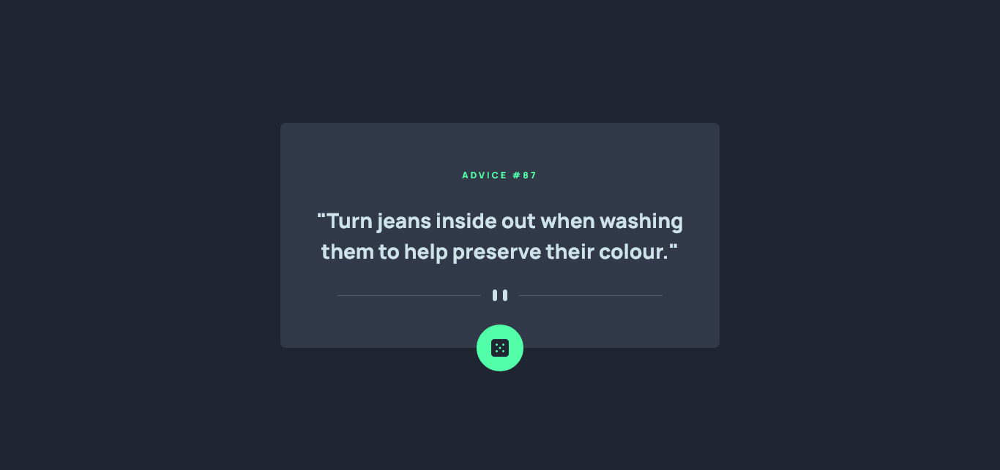

# Frontend Mentor - Advice generator app solution

This is a solution to the [Advice generator app challenge on Frontend Mentor](https://www.frontendmentor.io/challenges/advice-generator-app-QdUG-13db). Frontend Mentor challenges help you improve your coding skills by building realistic projects.

## Table of contents

- [Overview](#overview)
  - [The challenge](#the-challenge)
  - [Screenshot](#screenshot)
  - [Links](#links)
- [My process](#my-process)
  - [Built with](#built-with)
  - [Useful resources](#useful-resources)
- [Author](#author)

## Overview

### The challenge

Users should be able to:

- View the optimal layout for the app depending on their device's screen size
- See hover states for all interactive elements on the page
- Generate a new piece of advice by clicking the dice icon

### Screenshot

### Links

- Solution URL: [Source Code](https://github.com/eeyvee-0x4d/fmentor-advice-generator)
- Live Site URL: [Live site](https://fmentor-advice-generator.netlify.app)

## My process

### Built with

- Semantic HTML5 markup
- CSS custom properties
- Flexbox
- Mobile-first workflow
- [React](https://reactjs.org/) - JS library
- [TailwindCSS](https://tailwindcss.com/)

### Useful resources

- [TailwindCSS](https://www.tailwindcss.com)
- [Advice Slip API](https://api.adviceslip.com/)

## Author

- Website - [Al Vincent Musa](https://eeyvee-0x4d.github.io/portfolio/)
- Frontend Mentor - [@eeyvee-0x4d](https://www.frontendmentor.io/profile/eeyvee-0x4d)
